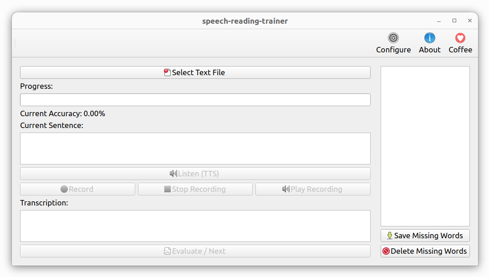

# speech-reading-trainer

A desktop application that helps users improve reading fluency and pronunciation by combining text-to-speech playback, voice recording, automatic transcription, and real-time accuracy feedback.



## 1. Installing

To install the package from [PyPI](https://pypi.org/project/speech_reading_trainer/), follow the instructions below:


```bash
pip install --upgrade speech_reading_trainer
```

Execute `which speech-reading-trainer` to see where it was installed, probably in `/home/USERNAME/.local/bin/speech-reading-trainer`.

### Using

To start, use the command below:

```bash
speech-reading-trainer
```

An example input file can be downloaded to [example1.txt](https://github.com/trucomanx/SpeechReadingTrainer/blob/main/data/example1.txt).

## 2. More information

If you want more information go to [doc](https://github.com/trucomanx/SpeechReadingTrainer/blob/main/doc) directory

## 3. Buy me a coffee

If you find this tool useful and would like to support its development, you can buy me a coffee!  
Your donations help keep the project running and improve future updates.  

[☕ Buy me a coffee](https://ko-fi.com/trucomanx) 

## 4. License

This project is licensed under the GPL license. See the `LICENSE` file for more details.
